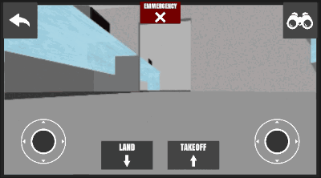

# Unity_Bebop_Drone_Remote-TCP
A Unity remote application for controlling Bebop drones over TCP with ROS-side python server

This project is a simple remote sending some basic drone-control inputs over TCP on a given ip / port combination.

There should be two servers ready for communication with the application:

* A recieve server interpreting input data and transmitting it to the drone (port X - ex:6789)
* A send server transmitting camera-feedback encoded in jpg (port X+1 - ex:6790)

